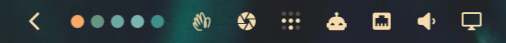

<p align="center">
  
</p>

<h1 align="center">omarchy-rgb-sync</h1>

<p align="center">
  Makes RGB hardware follow the current <a href="https://omarchy.org">Omarchy</a> theme.
</p>

<p align="center">
  
</p>

When you run `omarchy theme set`, every RGB device OpenRGB supports — mice,
keyboards, DRAM, GPUs, motherboards, Corsair iCUE Link fans and coolers,
Philips Hue lights — is set to a gradient built from the theme's colors. A
bar widget shows what was applied.

## How it works

Four pieces:

- **`rgb-sync`** — a script installed as an Omarchy `theme-set` hook (runs on
  every theme change) and `post-boot` hook (re-applies colors when the desktop
  starts). It reads color values from the active theme's `colors.toml`, builds
  a gradient through them, and applies it with the OpenRGB CLI.
- **`openrgb-server.service`** — a systemd user service running
  `openrgb --server`. Some devices, including Logitech wireless mice and
  Corsair iCUE Link hubs, revert to their onboard lighting profile a moment
  after host software disconnects. The server stays connected, so applied
  colors persist.
- **A bar widget** (`io.github.lewispb.rgb-sync`) — shows dots sampled from
  the applied gradient in the Omarchy bar. The tooltip reports the theme, device count,
  and time of the last sync; the dots dim if the last sync failed. Left click
  re-applies the current theme.
- **[OpenRGB](https://openrgb.org)** — does the device detection and control.
  Installed as a dependency.

For each device, the script picks a mode in this order:

1. **direct** — one color per LED; the device shows the gradient.
2. **custom** — same, for devices that name their per-LED mode "custom".
3. **static** — a single color; the device shows the first gradient color.

Devices with none of these modes are left unchanged. If a device has more
LEDs than gradient steps, OpenRGB applies the last color to the remaining
LEDs.

## Install

```bash
git clone https://github.com/lewispb/omarchy-rgb-sync.git
cd omarchy-rgb-sync
./install.sh
```

The installer adds the `openrgb` package if missing, enables the user
service, installs both hooks and the bar widget, and applies the current
theme's colors.

The repository doubles as an [Omarchy plugin](https://plugins.omarchy.org/develop.html):
the widget alone can be installed with
`omarchy plugin add https://github.com/lewispb/omarchy-rgb-sync --enable`,
but the widget only displays what the hooks record, so `./install.sh` is the
complete setup.

## Configure

Optional. Create `~/.config/omarchy/rgb-sync.conf` (shell syntax):

```bash
STYLE=gradient                        # "solid" uses one color everywhere
ANCHORS="accent magenta cyan blue"    # colors.toml keys, in gradient order
STOPS=24                              # number of gradient steps generated
```

`ANCHORS` accepts any keys defined in a theme's `colors.toml`, such as
`accent`, `red`, `green`, `blue`, `cyan`, `magenta`, `yellow`, `foreground`.
Keys a theme does not define are skipped. If a theme defines none of them,
the script falls back to the theme's `keyboard.rgb` file, and exits without
changing anything if that is also absent.

Re-apply after editing:

```bash
~/.config/omarchy/hooks/theme-set.d/rgb-sync
```

## Monitoring

Every run writes two files under `~/.local/state/omarchy-rgb-sync/`:

- `status.json` — theme, gradient colors, per-device mode assignments, and
  the result of the last run. The bar widget reads this file and updates
  whenever it changes.
- `sync.log` — one line per run, kept to the last 200 lines.

If the bar widget does not appear after install, add it with:

```bash
omarchy bar put io.github.lewispb.rgb-sync --section right
```

## Device notes

- **Logitech wireless mice** work through the Lightspeed USB receiver with no
  extra setup; OpenRGB addresses the mouse's HID++ device directly.
- **Philips Hue** is supported through OpenRGB's Hue integration, which needs
  a one-time bridge pairing: stop the server
  (`systemctl --user stop openrgb-server`), run `openrgb --gui`, add the
  bridge under Settings → Philips Hue Devices, press the bridge's link button
  when prompted, close the GUI, and start the server again
  (`systemctl --user start openrgb-server`). The lights then appear as
  devices and the sync includes them.
- **Keyboards with onboard-only modes** (no direct mode) get the static
  fallback, so they show a single theme color rather than the gradient.
- **DRAM, motherboard, and GPU control** uses I2C/SMBus. The OpenRGB package
  installs the udev rules this needs; a reboot after first install helps if
  those devices are not detected.
- OpenRGB may log `iCUE LINK ADAPTER has 0 LEDs` for unpopulated hub ports.
  This is harmless.

## Uninstall

```bash
./uninstall.sh
```

Devices return to their onboard lighting on next reconnect or reboot.

## License

MIT
