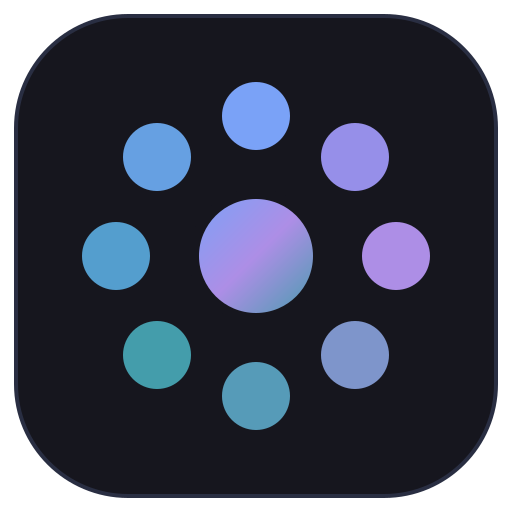
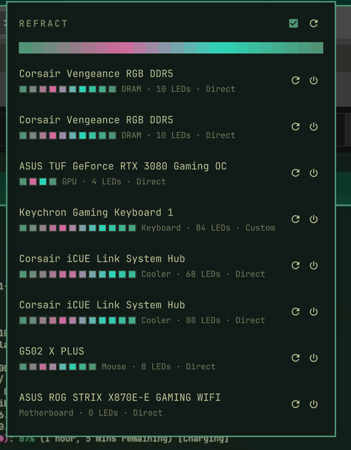

<p align="center">
  
</p>

<h1 align="center">Refract</h1>

<p align="center">
  Multi-color theme sync for RGB hardware, in the <a href="https://omarchy.org">Omarchy</a> bar.
</p>

<p align="center">
  
</p>

Refract builds a gradient from the active Omarchy theme's palette — accent
through magenta, cyan, and blue by default — and spreads it across every LED
of every device OpenRGB supports: mice, keyboards, DRAM, GPUs, motherboards,
Corsair iCUE Link fans and coolers, Philips Hue lights. Switch themes and the
hardware switches with it, as a spectrum rather than a single color.

Dots in the bar show the gradient the current theme produces. The panel
behind them lists every device with its colors as the OpenRGB server reports
them — changes made from the OpenRGB app or another SDK client show up within
a few seconds — plus a re-apply and a power button per device, and a toggle
for following the theme.

## Install

```bash
omarchy plugin add https://github.com/lewispb/omarchy-refract.git --enable
```

That is the whole setup. The widget lands in the bar's right section; move it
with `omarchy bar move io.github.lewispb.refract --section center`.

OpenRGB is the one dependency (`sudo pacman -S openrgb`). When the SDK server
is not running, Refract starts `openrgb --server` itself once per session —
or connects to one you manage, such as a systemd user service.

## How it works

Three pieces, all inside the plugin:

- **A service** (`Service.qml`) owns the connection and watches the active
  theme's `colors.toml`. When the file changes — which is what
  `omarchy theme set` causes — the gradient is rebuilt from the configured
  anchor keys and re-applied to every device not switched off.
- **A Python bridge** (`bridge/openrgb_bridge.py`) speaks the OpenRGB SDK
  binary protocol over TCP, with no dependency beyond the standard library.
  It resamples the gradient to each device's exact LED count — a device with
  ten or more LEDs gets the full spectrum, a smaller one a blend of the first
  two anchors, since four diodes showing four hues reads as noise — and polls the server so
  the panel mirrors reality, not just the last command.
- **A bar widget and panel** show the gradient and the devices, with
  re-apply, per-device power, and the theme-follow toggle.

## Settings

In the bar's widget settings (or `omarchy bar set io.github.lewispb.refract <key> <value>`):

| Key | Default | Meaning |
|-----|---------|---------|
| `themeSync` | `true` | Re-apply the gradient whenever the theme changes. |
| `style` | `gradient` | `solid` sends only the first anchor color. |
| `vivid` | `true` | LEDs render mid-saturation colors as washed out, so hardware colors are sent with lifted saturation and brightness. Turn off to send the exact theme colors. |
| `anchors` | `accent magenta cyan blue` | `colors.toml` keys the gradient passes through, in order. Keys a theme does not define are skipped. |
| `autoStartServer` | `true` | Start `openrgb --server` once per session if nothing answers. |
| `host` / `port` | `127.0.0.1` / `6742` | Where the OpenRGB SDK server listens. |

## Device notes

- **Logitech wireless mice** work through the Lightspeed USB receiver;
  OpenRGB addresses the mouse's HID++ device directly.
- **Devices without a per-LED mode** are set through their custom mode when
  the server offers one; a device with neither is left unchanged.
- **Philips Hue** needs a one-time bridge pairing in the OpenRGB GUI
  (Settings → Philips Hue Devices, then press the bridge's link button).
  After that the lights appear as devices like any other.
- **DRAM, motherboard, and GPU control** uses I2C/SMBus; the OpenRGB package
  installs the udev rules this needs.
- Some devices revert to their onboard lighting when no SDK client is
  connected. Refract's bridge stays connected while the shell runs, so
  applied colors persist.

## Credits

- [OmaRGB](https://github.com/ilkaydnc/omargb) by Ilkay Dinc set the
  architecture this plugin follows — a shell service owning a Python bridge
  to the OpenRGB SDK, with the panel mirroring server state instead of only
  sending to it. Refract exists because OmaRGB syncs one accent color and I
  wanted the whole palette; if you want per-device mode, brightness, and
  speed controls or stealth mode, use OmaRGB (running both at once means two
  clients writing to the same devices).
- [OpenRGB](https://openrgb.org) does the actual device support — hundreds of
  controllers behind one SDK.
- [Omarchy](https://omarchy.org)'s plugin system hosts the whole thing:
  service, widget, and panel run inside the shell with no extra process
  beyond the bridge.

## License

MIT
